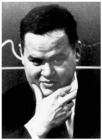
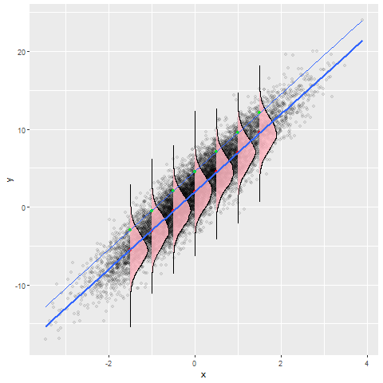
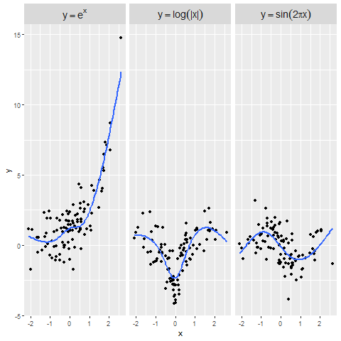
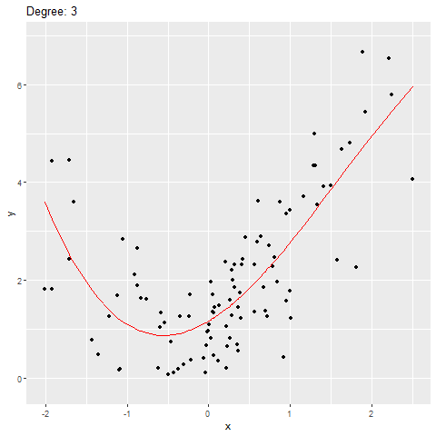

# Introduction

The Semiparametric Quantile Regression project is developing quantile regression methods combined with modern model fitting algorithms to predict high-cost patients using the VA's EHR data.

The project combines
- prediction using quantile regression
- flexible modeling of predictors using splines
- model regularization via penalization
- distributed model fitting algorithm for handling EHR-scale data

# Background - CAN Score and Nosos model

The VHA's EHR system has been used in the past to create predictive models. The [Care Assessment Needs (CAN) Score](https://www.va.gov/HEALTHCAREEXCELLENCE/about/organization/examples/care-assessment-needs.asp) uses an array of factors to predict risk of hospitalization or death within certain timeframes (e.g. 90 days, 1 year). The formulation of the first version of the CAN score is detailed in [Wang et al, 2013](https://github.ec.va.gov/ECSO/semiparametric/blob/master/references/wang2013.pdf).

The [Nosos model](https://www.herc.research.va.gov/include/page.asp?id=risk-adjustment) is a model that uses data on risk factors combined with VHA-specific demographics and pharmacy data to produce predictions of individuals' health care costs in the coming year. The predicted mean cost for an individual is then compared to the national average in the VA to produce a risk score. For instance, a Nosos score of 3 would indicate that a patient's predicted health care costs for the coming year will be 3 times the national average.

# Quantile Regression for Prediction and Classification

>What the regression curve does is give a grand summary for the
averages of the distributions corresponding to the set of of x’s.
We could go further and compute several different regression
curves corresponding to the various percentage points of the
distributions and thus get a more complete picture of the set.
Ordinarily this is not done, and so regression often gives a rather
incomplete picture. Just as the mean gives an incomplete picture
of a single distribution, so the regression curve gives a
correspondingly incomplete picture for a set of distributions.
\- John Tukey

Quantile regression is a statistical technique for estimating characteristics of the distribution of an outcome given certain covariates. Similar to how least-squares regression can be thought of as estimating a conditional mean, quantile regression estimates a particular conditional quantile. As noted in the quote from Tukey above, quantile regresssion can be thought of as filling out the picture of the conditional distribution of the outcome given the predictors that least squares regression just begins to paint.

For the purposes of this project, we are not as interested in the quantile regression itself as we are in the ability of quantile regression to produce binary classifications *without* introducing an artificial dichotomization of the continuous cost outcome. We prefer it over logistic regression for exactly that reason. By modeling the outcome on its original scale and delaying dichotomization into high/low cost categories until the very last modeling step, we expect to extract more information from the data and therefore produce better predictions. Details about how quantile regression can be used to produce binary classifications can be found in [Maidman and Wang, 2016](https://github.ec.va.gov/ECSO/semiparametric/blob/master/references/Maidman_Wang_2016.pdf).

# Modern Statistical Model Fitting Methods

## Flexible Modeling of Predictors through Splines

Continuous predictors are often represented in regression models by a single slope parameter. While this representation is convenient and easily interpretable, it can perform poorly when the relationship between the outcome and the predictor is not close to linear. Regression splines offer a practical and straightforward approach to modeling continuous predictors without imposing linearity constraints or searching for transformations to achieve linearity.

The figure below shows three datasets where a predictor is related to the outcome in non-linear fashion with fitted regression spline curves in blue. In each case, the regression spline is able to detect the non-linear relationship without prespecifying its form. 

## Penalization to Control Overfitting
Overfitting is one of the most important phenomena in statistics. Overfitting refers to the fact that more complex models can provide excellent fits to the *data at hand* but can fail miserably when used to predict *new observations*. A rudimentary example of the overfitting phenomenon is shown below, in which an outcome Y is regressed on a single variable X using a polynomial of increasing degree.

As the degree of the polynomial increases, the fitted curve adheres closer and closer to the data points. This reduces the in-sample error because the curve is becoming better and better at predicting the individual data points used to fit the curve. Such highly specific fits will not perform very well at predicting new data because they are too *optimistic* that future data will look exactly like past data.

In general, there is a tension between predictive accuracy and model complexity. If the model is too simple, predictive accuracy will suffer because the model is not capturing the underlying dynamics of the predictor/outcome relationship. If the model is too complex, predictive accuracy will suffer because the model is too closely tied to the data at hand. The goal of a model fitting procedure is to find the ideal level of complexity.

One powerful technique for achieving the correct degree of model complexity is *parameter penalization*. In a penalized model, the coefficients associated with some or all of the predictor variables are constrained according to some penalty function. The degree of penalization therefore determines the complexity of the model. A large penalty pushes us towards a simpler model, while a small penalty allows for a more complex model. We can choose the degree of penalization through techniques such as cross-validation. Details about penalized quantile regression models can be found in [Sherwood and Wang](https://github.ec.va.gov/ECSO/semiparametric/blob/master/references/Sherwood_Wang_2016.pdf)

# Distributed Algorithms for Large-Scale EHR Data

 The VHA's EHR system contains thousands of variables measured on millions of Veterans. Fitting complex statistical models to data on this scale is challenging for several reasons. First, the time it takes to fit a model to data on that scale using standard techniques may be prohibitively long. Second, depending on the dimensionality of the data, computing resources may be too limited.

The easiest way of getting around this issue would be to use a smaller random subsample of the data to train the model on. However, such an approach obviously does not take full advantage of the data at hand. Our project employs an alternative approach based on the Alternating Direction Method of Multipliers (ADMM) algorithm that will allow us to fit our preferred statistical model at scale. The ADMM algorithm allows us to do this by working in a *distributed* manner.

[Boyd 2010](https://github.ec.va.gov/ECSO/semiparametric/blob/master/references/Boyd_2010.pdf) provides an overview of the ADMM algorithm. [Yu 2017](https://github.ec.va.gov/ECSO/semiparametric/blob/master/references/Yu_2017.pdf) details the application of the ADMM algorithm to quantile regression.
